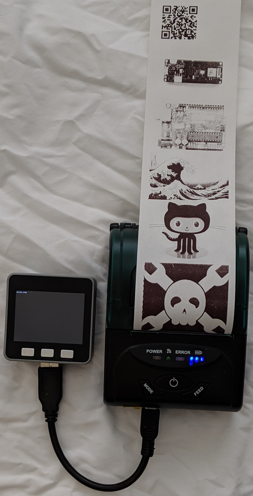
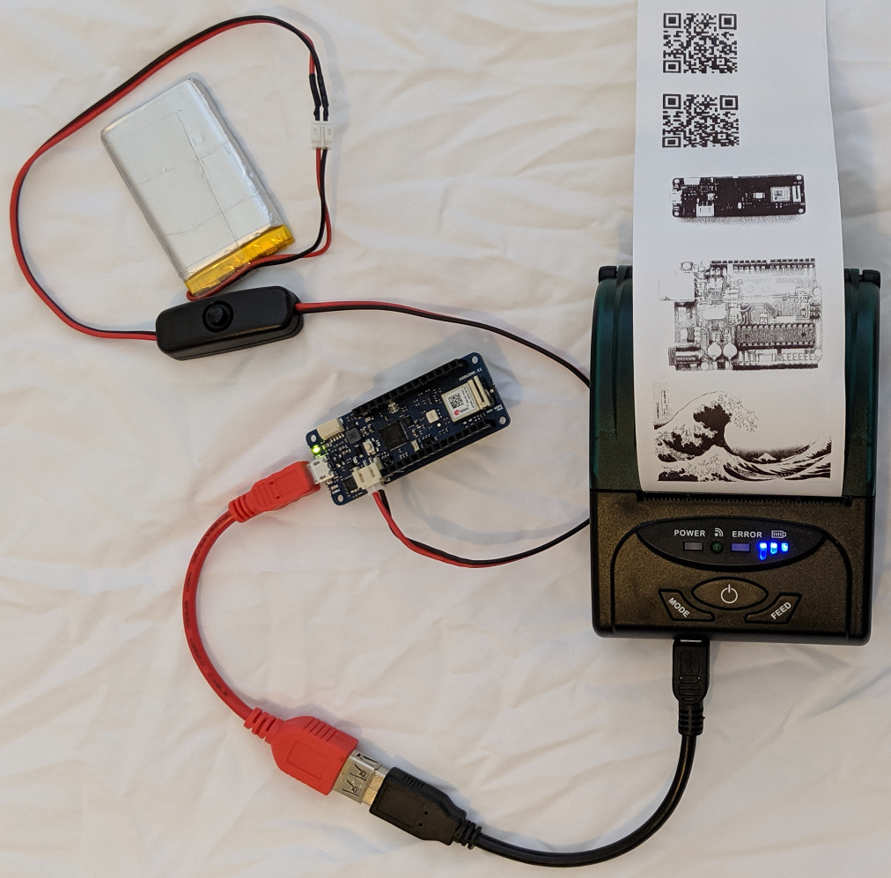

# Arduino MKR and M5Stack Printing on Portable Receipt Printer

Print pictures from Flash on a portable USB thermal printer. The printer and
the MKR and M5Stack boards are running from their own batteries.

## M5Stack Core + USB host module



This option is a nicely packaged ESP32 with battery and display. The optional
M5Stack USB module provides the USB host interface for the printer. The USB
module is based on the MAX3421E USB chip which is supported by the USB Host
Shield 2.0 library.

### Hardware

* M5Stack core (ESP32, battery, display, etc.) https://m5stack.com/collections/m5-core/products/grey-development-core
* M5Stack USB host module (MAX3421E) https://m5stack.com/collections/m5-module/products/usb-module
* USB cable for printer (black cable in picture)
* USB thermal receipt printer, 58mm wide, battery powered

### Libraries

* USB Host Shield 2.0 https://github.com/felis/USB_Host_Shield_2.0
* USB Printer driver https://github.com/gdsports/USBPrinter_uhs2
* ESC POS library https://github.com/gdsports/ESC_POS_Printer

## Arduino MKR board



### Hardware

* Arduino MKR WiFi 1010 (SAMD21)
* Lithium battery
* USB OTG to host cable (red cable in picture)
* USB cable for printer (black cable in picture)
* USB thermal receipt printer, 58mm wide, battery powered

### Libraries

* USB Host Library for SAMD https://github.com/gdsports/USB_Host_Library_SAMD
* USB Printer driver https://github.com/gdsports/USBPrinter_uhls
* ESC POS library https://github.com/gdsports/ESC_POS_Printer

The MKR board is powered by the battery shown. The printer is powered by its
internal battery so the battery in the picture is not powering the printer.

This example program does not use the WiFi network so a MKR Zero should also
work.

## Portable receipt printer

The printer has two identical mini USB sockets. Be sure use the one labelled
USB. The one labelled COM is an RS-232 port. The voltage is not compatible
with USB and may damage the MKR or M5Stack board.

Links to shopping websites tend die so to find a similar printer, try the
search term "portable thermal receipt printer" on your favorite shopping
website. Unfortunately, it is not possible to tell if a printer is compatible
with the ESC POS library so some changes may be necessary. Different printers
implement different subsets of the ESC POS commands.

## Convert picture to include file

mkpic.sh converts any image file supported by ImageMagick convert to a C
include file. The image is resized to fit on a 384 dot wide printer. Colors are
converted to dithered black and white dots. To preview the result, view output
file bitmap.png. The other output file is the image name with ".h" appended.

$ ./mkpic.sh wave.png

bitmap.png is a black and white version of the wave.png file.

wave.png.h is a C include file with the black and white image processed
for printing using the ESC * command. The Python program bitmapband.py
converts bitmap.png to a C include file transposing rows and columns as
needed.

Example output

```
#define bitmap_width   384
#define bitmap_height  258
#define bitmap_density 2

const uint8_t bitmap_data[] PROGMEM = {
0, 0, 0, 72, 16, 36, 2, 66, 0, 16, 0, 72, 65, ...
...
};
```

If the result is too light or dark, use a paint program such as PhotoShop or
GIMP to adjust the image before running mkpic.sh.
